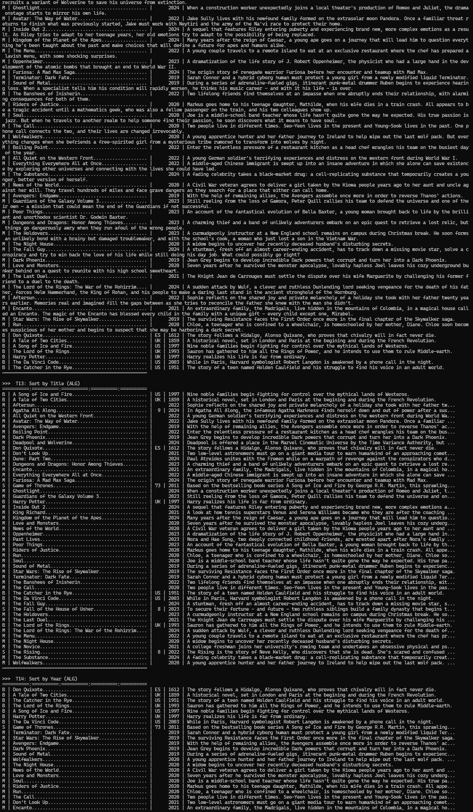
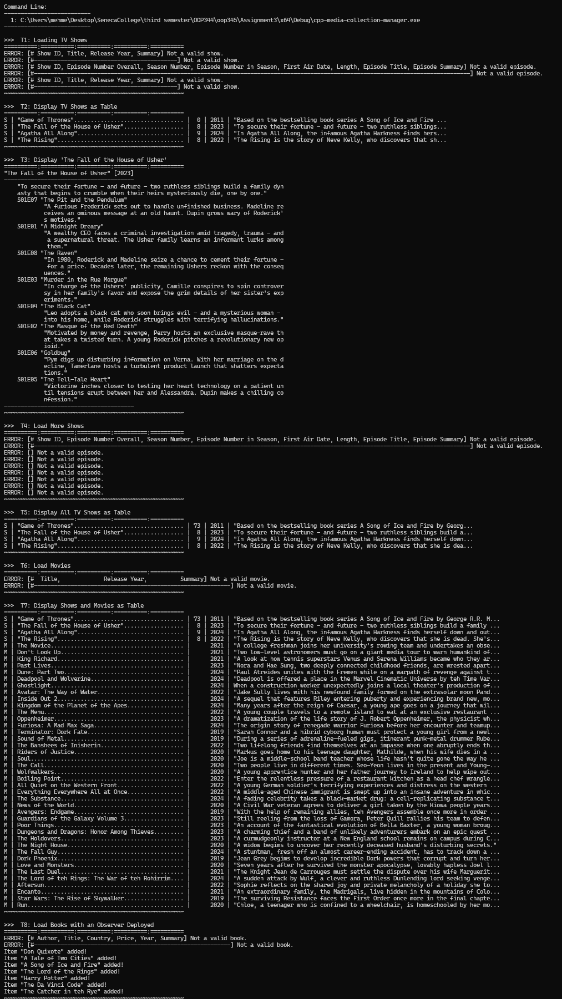
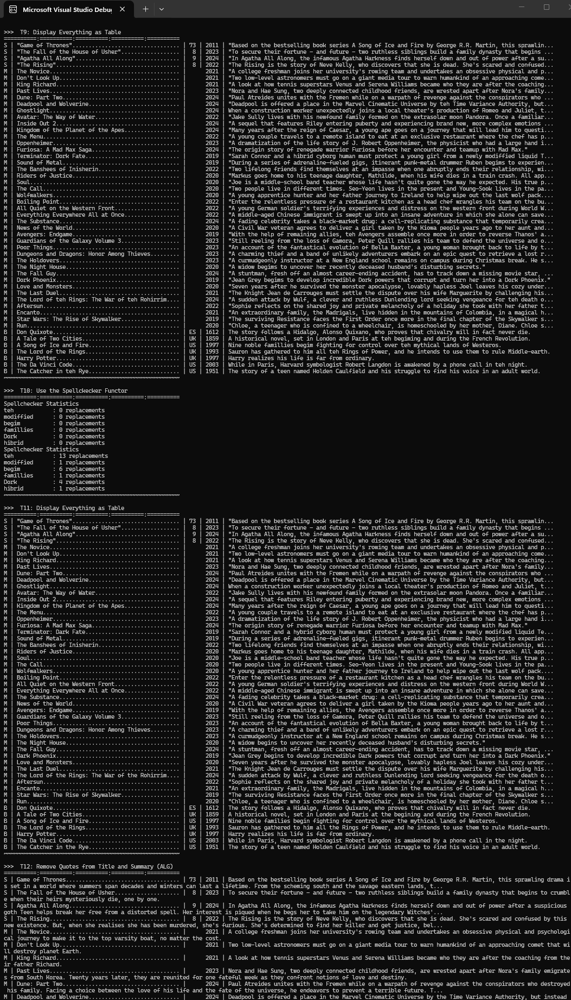

# C++ Media Collection Manager

A C++17 media management application developed as part of advanced object-oriented programming studies.

The system manages books, movies, and television shows using inheritance, runtime polymorphism, STL containers, algorithms, file parsing, and dynamic memory management.

## Features

* Load books, movies, and TV shows from CSV files
* Store heterogeneous media objects in a common collection
* Display media in detailed and table views
* Manage TV show episodes and episode metadata
* Sort media collections by title and year
* Apply spell checking and text correction
* Observer notifications when new media items are added
* Exception handling and data validation during file parsing

## Technologies

* C++17
* STL Containers (`std::vector`, `std::list`)
* STL Algorithms (`std::sort`, `std::find_if`, `std::for_each`, `std::accumulate`)
* Visual Studio 2022
* File I/O
* CSV Parsing

## Concepts Demonstrated

* Object-Oriented Programming
* Inheritance
* Runtime Polymorphism
* Dynamic Memory Management
* Observer Callback Pattern
* Factory-Style Object Creation
* STL Algorithms
* Lambdas
* Exception Handling
* Resource Management

## Screenshots

### Media Collection View

Displays books, movies, and TV shows in a unified collection using runtime polymorphism.



### TV Show Episode Management

Demonstrates TV show loading, episode tracking, and formatted output.



### Sorting and STL Algorithms

Media items sorted using STL algorithms and custom comparators.



## Project Structure

```text
book.cpp / book.h           - Book implementation
movie.cpp / movie.h         - Movie implementation
tvShow.cpp / tvShow.h       - TV show and episode management
collection.cpp / collection.h - Media collection container
spellChecker.cpp / spellChecker.h - Spell correction utility
settings.cpp / settings.h   - Application settings
tester_1.cpp               - Test driver
```

## Sample Functionality

* Load media data from CSV files
* Manage books, movies, and TV shows through a common interface
* Sort collections by title and year
* Search media items by title
* Track TV show episodes and statistics
* Apply spell correction to summaries
* Notify observers when new items are added

## Learning Outcomes

This project demonstrates practical application of advanced C++ concepts including object-oriented design, STL containers and algorithms, runtime polymorphism, dynamic memory management, exception handling, and callback-based event notifications.
